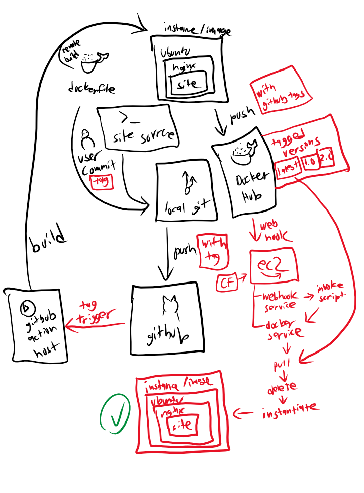

# CD Project Overview

In this project we're building a continuous deployment workflow that will publish releases of tagged builds from the GitHub repository.

Tools used:

* Git
* GitHub
* Docker
* DockerHub

## Diagram



## Generate a tag in Git/GitHub

After making your commit:
`git tag -a <version> -m <tag description>`

Tags aren't included with a push by default - modify your push command:
`git push --tags`

## GitHub workflow

Whenever tags are pushed to upstream:

* Publish image to DockerHub versioned with tags and separate image for `latest`

## Link to repository

Tags page
<https://hub.docker.com/repository/docker/sfurtaw/docker-website/tags?page=1&ordering=last_updated>

## Installing Docker

Resource: <https://docs.docker.com/engine/install/ubuntu/>

Automated the process in the CF template. No action required but here is the command:
```sh
apt-get update && \
apt-get install -y ca-certificates curl gnupg && \
mkdir -m 0755 -p /etc/apt/keyrings && \
curl -fsSL https://download.docker.com/linux/ubuntu/gpg | sudo gpg --dearmor -o /etc/apt/keyrings/docker.gpg && \
echo \
"deb [arch="$(dpkg --print-architecture)" signed-by=/etc/apt/keyrings/docker.gpg] https://download.docker.com/linux/ubuntu \
"$(. /etc/os-release && echo "$VERSION_CODENAME")" stable" | \
tee /etc/apt/sources.list.d/docker.list > /dev/null && \
apt-get update && \
apt-get install -y \
    docker-ce \
    docker-ce-cli \
    containerd.io \
    docker-buildx-plugin \
    docker-compose-plugin \
systemctl enable docker && \
systemctl restart docker && \
```

## Container restart script

The script is viewable at `deployment/pull-and-restart.sh`. To get the latest version, it pulls from DockerHub, stops/deletes the existing instance, then runs a new one. The web hook expects it to be located at `/home/ubuntu/repo/deployment/pull-and-restart.sh` (the CF template handles this)

## Web hook setup

The Ubuntu version was bumped up to 22 LTS to make this easier - it is also automated in the CF template. Here is how to do it manually:
```sh
sudo apt update
sudo apt install webhook
sudo systemctl enable webhook
sudo cp /path/to/hooks.json /etc/webhook.conf
sudo systemctl start webhook
```

## Web hook task definition

The JSON creates an endpoint named `redeploy-webhook` that will call the `pull-and-restart.sh` script with the working directory `/home/ubuntu/`. There is no secret configuration as this is just a demo.

It should be located at `/etc/webhook.conf`. (CF handles this)

## Configure DockerHub web hook

1. Go to repository page
2. Click Webhooks
3. Enter a name and enter this URL: `http://<EC2 elastic IP>/hooks/redeploy-webhook`
4. Click Create

## Recorded process

See `demo.mp4`
